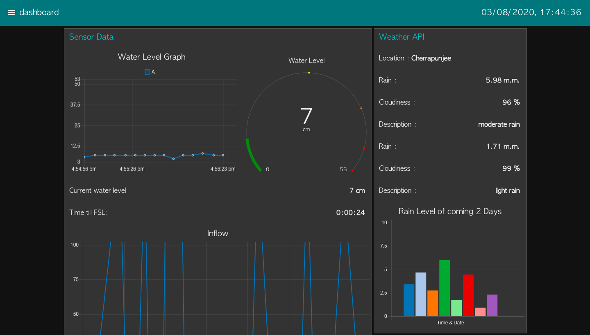
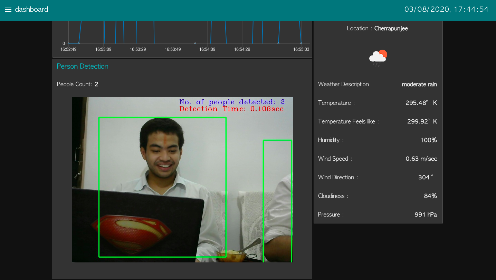

# LN379_Sampravah

Repository created by Team Sampravah for SIH-2020

Link to Final PPT: https://docs.google.com/presentation/d/1NR8QUCvvVnAIrW2F0SR5fOtUFcyi2sgmxDZVx3plV8k/edit?usp=sharing

# Team Members

# Mentors

# Expert Consultants

# Objective
To develop an IoT based effective advance Public Address and Flood Warning System

# Solution Prototype

# Solution Strategy

# Module 1: Water Level Sensing & Prediction

# Module 2: Computer Vision based Human Detection

# Module 3: Web Dashboard & Public Warning System

# USPs

# Working Prototype

      

# Results

## Dashboard

## Telegram Alert

 

## SMS Alert

## Email Alerts to Authorities, Police Stations and TV/Radio Stations

## Twitter Alerts

## Rescue Facilitation

